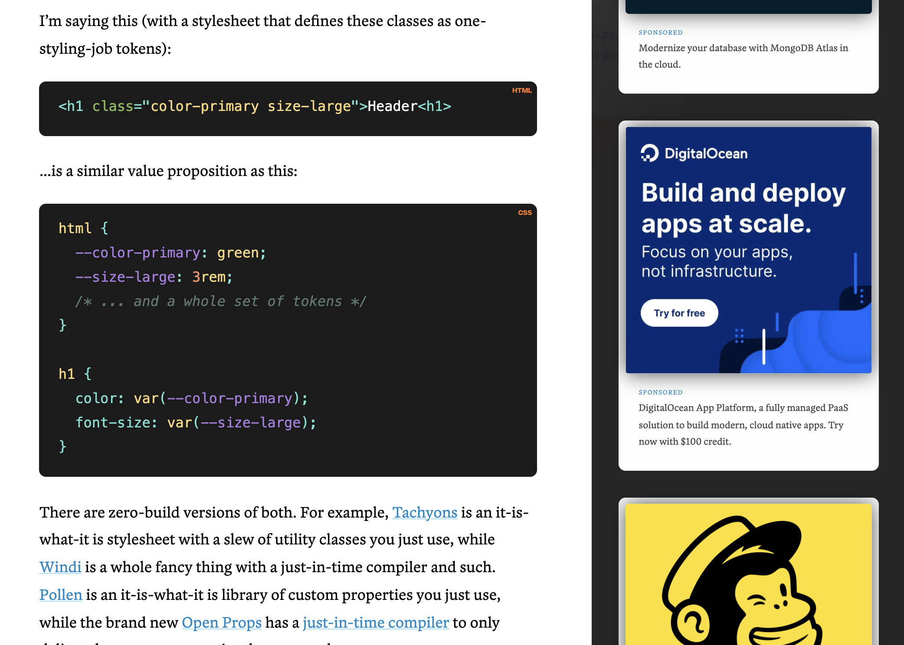
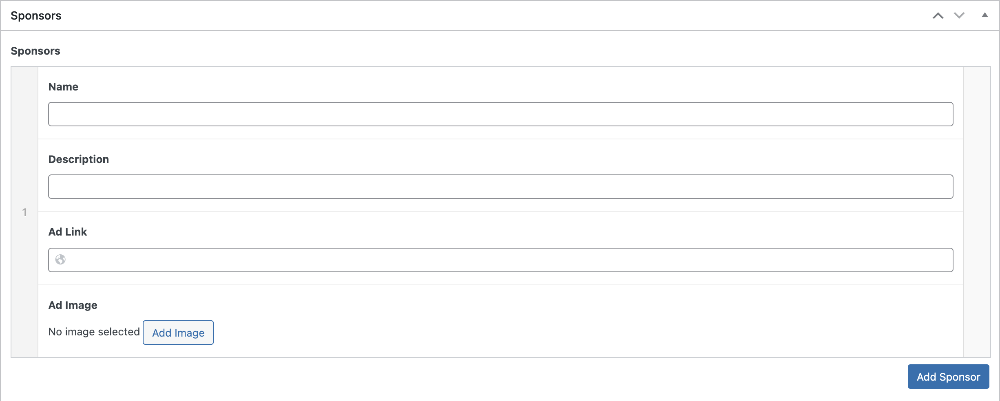

I created the theme for the BiggerPockets blog where they sell sponsor slots. The code you see below is similar to what I used to implement rotating sponsor slots with Alpine.js and Advanced Custom Fields. The video below shows ads rotating in on every page load.

<div style="position: relative; padding-bottom: 71.57057654075547%; height: 0;"><iframe src="https://www.loom.com/embed/f32d7fc61d8d42eb8b3f3f9dd586ab55" frameborder="0" webkitallowfullscreen mozallowfullscreen allowfullscreen style="position: absolute; top: 0; left: 0; width: 100%; height: 100%;"></iframe></div>

Advertising networks like AdSense, Mediavine, et al load ads dynamically via JavaScript. With lot's of JavaScript - and it kills page speed performance. Selling sponsored HTML ad spots is a great way to serve highly relevant ads that don't kill performance.

CSS-Tricks does this nicely:


## Managing ads within WordPress & Advanced Custom Fields



If you're working with WordPress, storing your sponsors and ads in a repeater field will work well. You can display this field group on an ACF options page if you'd like.

```php
acf_add_options_page(array(
    'page_title' 	=> 'Sponsors',
    'menu_title'	=> 'Sponsor Settings',
    'menu_slug' 	=> 'sponsor-settings',
    'capability'	=> 'edit_posts',
    'redirect'		=> false
));
```

## Build your `$sponsors` array:

Once you've got a place to create and store your sponsors, you can map it to a template.

Here's a simplified version of what that might look like. In my real world use case, I had to escape some fields that contained strings with single quotes. Otherwise is was resulting in malformed JSON later. So make sure you test this if you run into issues.

```php
// Prepare our array
$sponsors = [];

// Check if there are any sponsors in ACF
if (have_rows('sponsors', 'option')) {

    while ( have_rows('sponsors', 'option') ) {
        the_row();

        // Prepare the current sponsor in the loop
        $sponsor = array(
            'name'              => get_sub_field('name') )),
            'description'       => get_sub_field('short_description'),
            'ad_link'           => get_sub_field('ad_link'),
            'image'             => get_sub_field('image'),
        );

        // Push the current sponsor to the $sponsors array
        $sponsors[] = $sponsor;

  } // endwhile
} // endif
```

## The front-end template

Pass the sponsors array into an Alpine.data component, loop through that array, and map it to a `<template>`:

```php
<div x-data='sponsors(<?= json_encode($sponsors); ?>)'>
  <template x-for="sponsor in sponsors">
    <div>
        
        <p x-text="sponsor.name"></p>
        <p x-text="sponsor.description"></p>

        <a
        :href="ad.ad_link"
        x-text="ad.linkTitle"
        target="_blank">Learn more</a>

    </div>
  </template>
</div>
```

## Randomize the sponsors

Build our sponsors component logic:

If you're dealing with multiple sponsors, you might want to limit the number of ads that are displayed

```js
Alpine.data("sponsors", (sponsorsJSON) => ({
	sponsors: [],

	// Randomize an array
	shuffle(array) {
		return array.sort(() => Math.random() - 0.5);
	},

	init() {
		// Shuffle the array and return just the first two
		this.sponsors = this.shuffle(sponsorsJSON).slice(0, 2);
	},
}));
```

## Analytics

Track clicks and impressions with Alpine `@click` and `x-intersect`:

1. Add `x-intersect` to the parent div that calls the `sponsorViewed()` function
1. Add `@click` to the the CTA/link that calls the `sponsorClicked()` function

```php
<template x-for="sponsor in sponsors">
    <div x-intersect="sponsorViewed(sponsor.name)">
        
        <p x-text="sponsor.name"></p>
        <p x-text="sponsor.description"></p>

        <a
        @click="sponsorClicked(sponsor.name)"
        :href="ad.ad_link"
        x-text="ad.linkTitle"
        target="_blank">Learn more</a>

    </div>
</template>
```

Emit an event to Google Analytics or something similar when the sponsor/ad is clicked or viewed:

```js
sponsorClicked(sponsor, ) {
    gtag('event', 'click', {
        'event_category': 'Sidebar Ad',
        'event_label': sponsor
    })
},

sponsorViewed(sponsor) {
    gtag('event', 'view', {
        'event_category': 'Sidebar Ad',
        'event_label': sponsor
    });
},
```
